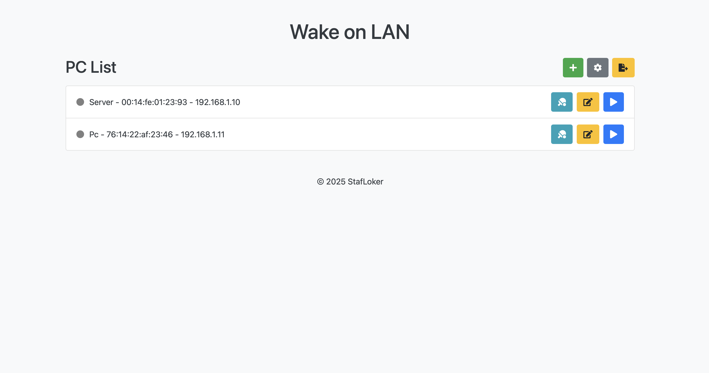

<div align="center">
   
   <h1><b>EspWOL</b></h1>
   <p><i>~ Wake & play! ~</i></p>
   <p align="center">
      <a href="https://stafloker.github.io/EspWOL/">Demo</a> ·
      <a href="https://github.com/StafLoker/EspWOL/releases">Releases</a> ·
      <a href="https://stafloker-espwol.apidocumentation.com">Docs</a>
   </p>
</div>

<div align="center">
   <a href="https://github.com/StafLoker/EspWOL/releases"></a>
   <a href="https://github.com/StafLoker/EspWOL/releases"></a>
   <a href="https://github.com/StafLoker/EspWOL/blob/main/LICENSE"></a>
   
   <div align="center">
      <a href="https://github.com/StafLoker/EspWOL/actions/workflows/build-and-release.yml">
         
      </a>
   </div>

   <p>This project provides a web-based interface for power on hosts using an ESP8266 and Wake On Lan magic packets.</p>


</div>

## Alerts

> [!IMPORTANT]
> [Instruction](#migration-from-v2xx-to-v3xx) of migration to version `3.x.x`.

> [!IMPORTANT]
> Same [instruction](#migration-from-v2xx-to-v3xx) to upgrade from version `2.x.x` to version >= `3.x.x`.

## Features

### App logic

- **CRUD Host Management**: Full CRUD functionality to manage host information with persistent storage.
- **Wake on LAN (WoL)**: Send magic packets to wake hosts remotely with real-time feedback.
- **Session-Based Authentication**: Secure token-based authentication with configurable credentials and 15-minute session timeout.
- **Network Configuration**: Switch seamlessly between static IP and DHCP modes with automatic restart.
- **Host Ping Utility**: Test connectivity by pinging specified hosts with automatic status updates.
- **Periodic Ping & Auto-Wake**: Configure periodic pings with automatic WoL for offline hosts.
- **Database Export/Import**: Export and import host databases in CSV format.

### User experience

- **Mobile-Friendly UI**: Responsive web interface optimized for all screen sizes.
- **Dark Mode**: Toggle between light and dark themes for better user experience.
- **Internalization**: Web UI in Russian, English, Spanish languages.

### Other

- **Over-The-Air (OTA) Updates**: Secure OTA updates with password: `ber#912NerYi`.
- **mDNS Support**: Access the web interface using `wol.local` domain name.
- **WiFi Manager**: Built-in WiFi configuration portal for easy network setup.

## Requirements

- **Hardware**: ESP8266 board (e.g., NodeMCU, Wemos D1 Mini).
- **Software**:
  - Arduino IDE
  - ESP8266 Core for Arduino
- **Libraries**:
  - [WakeOnLan](https://github.com/a7md0/WakeOnLan)
  - [WiFiManager](https://github.com/tzapu/WiFiManager)
  - [ArduinoJson](https://github.com/bblanchon/ArduinoJson)
  - [ESP8266Ping](https://github.com/dancol90/ESP8266Ping)
  - [ArduinoOTA](https://github.com/JAndrassy/ArduinoOTA)
  - [GTimer](https://github.com/GyverLibs/GTimer)

## Installation

### Requirements

Installation of the CH341 driver is required. Use the following links to download and install it:

- **Windows:** [Download CH341SER.EXE](https://wch-ic.com/downloads/CH341SER_EXE.html)
- **Linux** [Download CH341SER_LINUX_ZIP](https://wch-ic.com/downloads/CH341SER_LINUX_ZIP.html)
- **MacOS:** [Download CH341SER_MAC.ZIP](https://wch-ic.com/downloads/CH341SER_MAC_ZIP.html)

After installation, add the following URL to the **Arduino IDE** settings:

```
http://arduino.esp8266.com/stable/package_esp8266com_index.json
```

Then, install the latest version of the **ESP8266** board package via the **Boards Manager** in the Arduino IDE.

---

### Method 1: Using Arduino IDE

1. **Clone the Repository:**
   ```bash
   git clone [repository-url]
   ```
2. **Open the Project:** Open the cloned project in the **Arduino IDE**.
3. **Install Required Libraries:** Use the **Library Manager** in the Arduino IDE to install all necessary libraries.
4. **Upload the Code:** Connect your ESP8266 board and upload the code.

---

### Method 2: Using Precompiled Binary

1. **Download the Binary File** (`EspWOL.bin`) from the latest release.
2. **Flash the Firmware:** Use one of the following online tools to flash the binary:
   - [ESP Huhn](https://esp.huhn.me)
   - [ESPHome Web](https://web.esphome.io)

## Usage

### Initial Setup

1. **First Boot**:

   - Power the ESP8266. If no WiFi is configured, it will create an access point named `WOL-ESP8266`.
   - Connect to this network and configure your WiFi credentials.

2. **Access Web Interface**:

   - After WiFi setup, find the device IP address (check your router or use `wol.local` if mDNS is enabled).
   - Open the IP address in a web browser.

3. **Login**:
   - Default credentials: `glavniy` / `Lep#Chick43`
   - Change these credentials immediately in Avatar → Account.

### Configuration

- **Network Settings**: Configure static IP or use DHCP.
- **Ping Period**: Set automatic ping intervals (0 to disable, or 1 min to 24 hours).
- **Authentication**: Update username and password.
- **WiFi Reset**: Reset WiFi credentials to reconfigure network.

## Migration from v2.x.x to v3.x.x

> [!CAUTION]
> Version 3.x.x introduces breaking changes in authentication and data storage format.

1. **Export from v2.x.x**:

   - Export your host database before upgrading.
   - Note your current settings and credentials.

2. **Flash v3.x.x**:

   - Upload **version 3.x.x** to the device with the **"All Flash Contents"** option enabled.

3. **Reconfigure**:

   - Set up WiFi connection.
   - Login with default credentials: `glavniy` / `Lep#Chick43`
   - Import your host database via the Import function.
   - Reconfigure your settings and update credentials.

4. **Verify**:
   - Test all hosts and functionality.
   - Migration complete!

## Technical Details

- **Session Management**: 15-minute timeout with automatic cleanup
- **Password Requirements**: Minimum 8 characters with uppercase, lowercase, and special characters
- **Storage**: LittleFS for persistent configuration and host data
- **Network**: Supports both DHCP and static IP configuration
- **Ping Values**: Configurable intervals from 1 minute to 24 hours
- **MAC Format**: Standard format AA:BB:CC:DD:EE:FF
- **File System**: JSON-based configuration files

## Troubleshooting

- **Can't connect to WiFi**: Reset WiFi settings via the web interface or reflash firmware
- **Forgot password**: Reflash firmware to reset to defaults
- **Host won't wake**: Verify MAC address, ensure target device supports WoL
- **mDNS not working**: Some networks don't support mDNS; use IP address instead

## Contributing

Contributions are welcome! Please read the contributing guidelines and submit pull requests for any improvements.

## License

This project is licensed under the terms specified in the LICENSE file.
