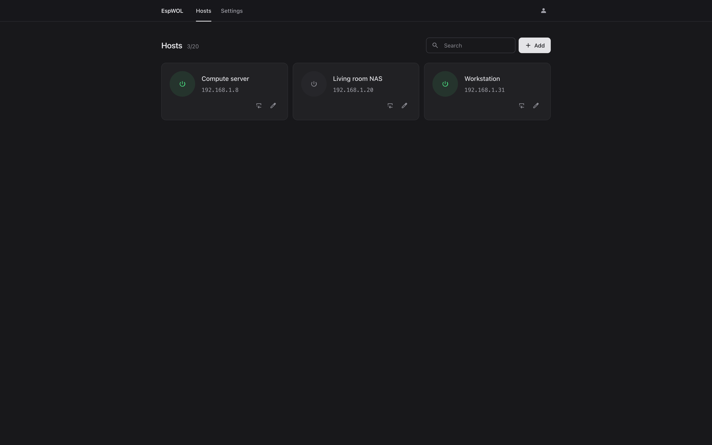
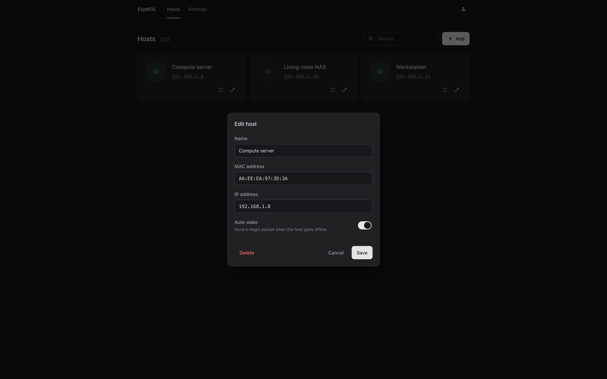
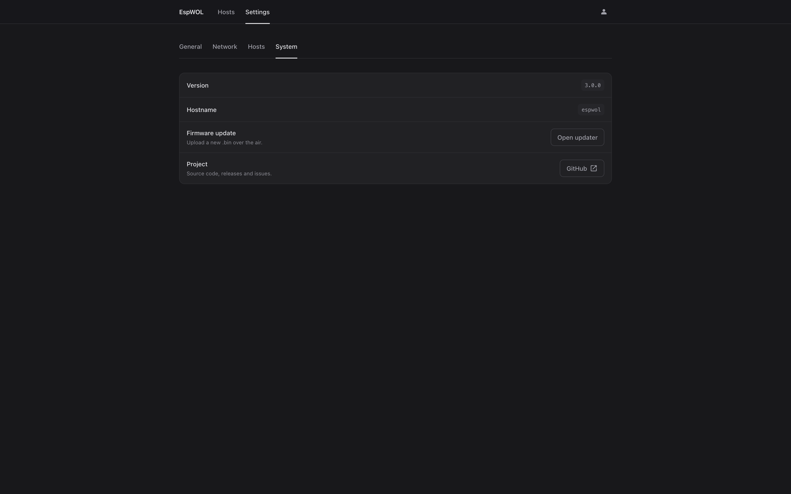
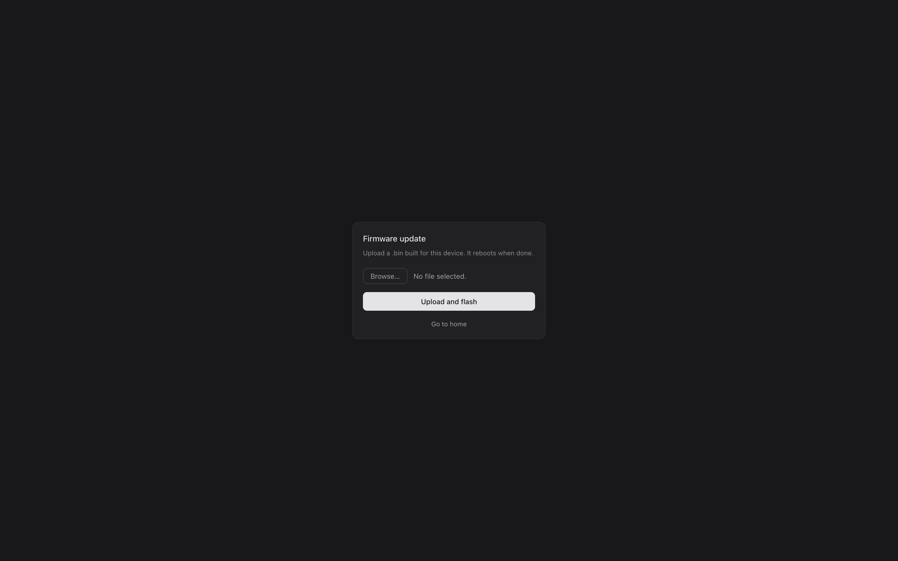
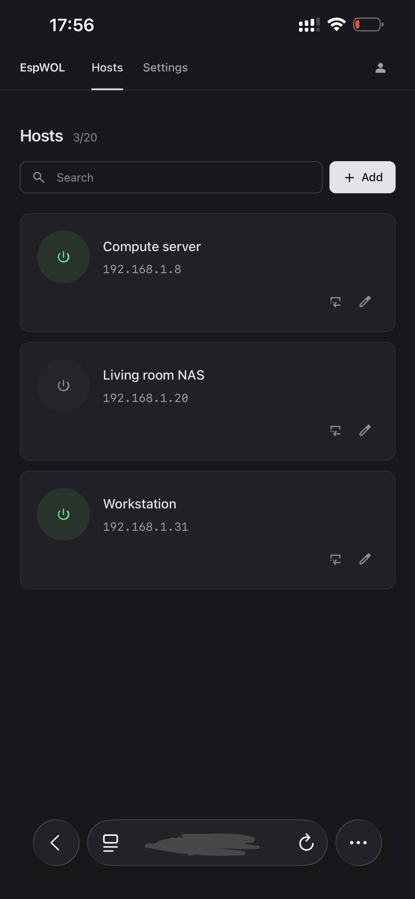
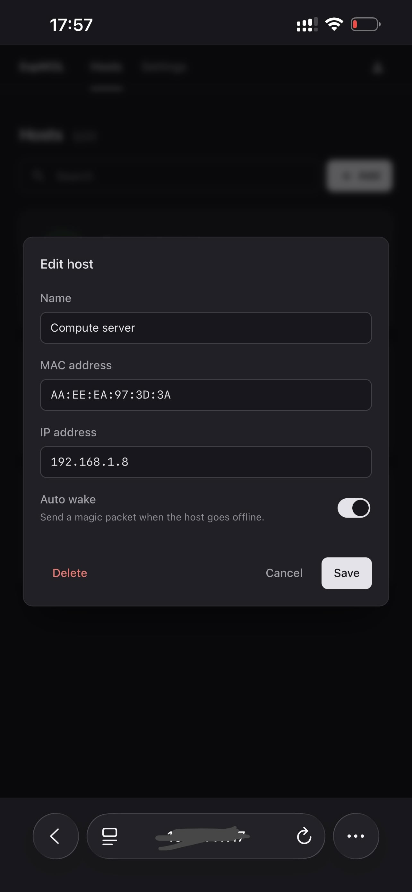
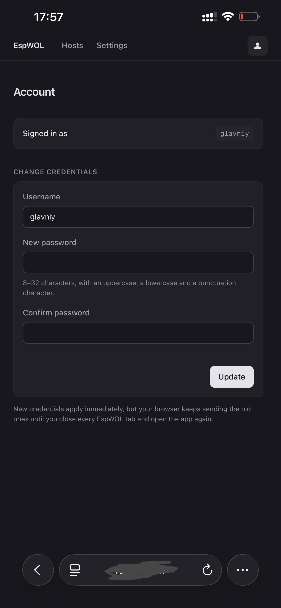
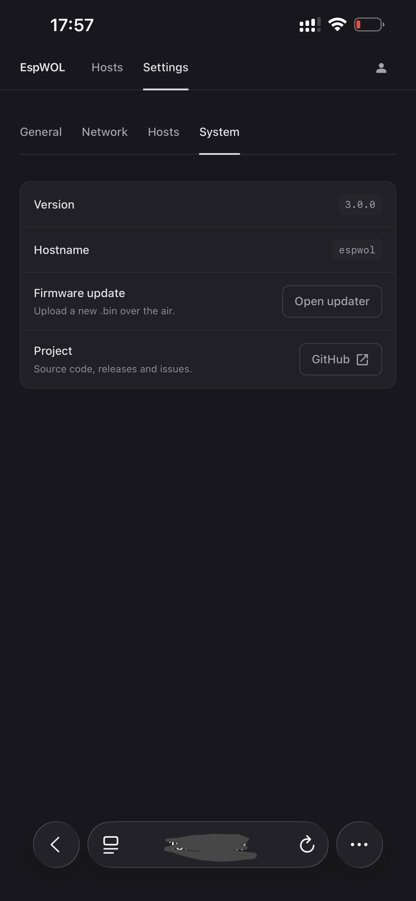
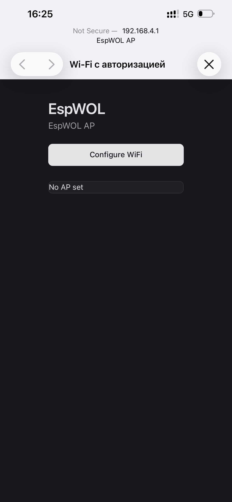
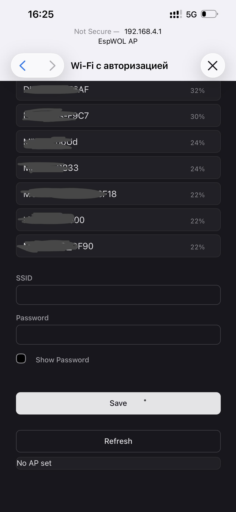

<div align="center">
   
   <h1><b>EspWOL</b></h1>
   <p><i>~ Wake & play! ~</i></p>
   <p align="center">
      <a href="https://github.com/StafLoker/EspWOL/releases">Releases</a> ·
      <a href="docs/openapi.yaml">API reference</a> ·
      <a href="CHANGELOG.md">Changelog</a>
   </p>
</div>

<div align="center">
   <a href="https://github.com/StafLoker/EspWOL/releases"></a>
   
   <div align="center">
      <a href="https://github.com/StafLoker/EspWOL/actions/workflows/ci.yml">
         
      </a>
      <a href="https://github.com/StafLoker/EspWOL/actions/workflows/release.yml">
         
      </a>
   </div>

   <p>This project provides a web-based interface for power on hosts using an ESP8266 and Wake On Lan magic packets.</p>


</div>

## Alerts

> [!IMPORTANT]
> [Instruction](#migration-from-v2xx-to-v3xx) of migration to version `3.x.x`.

## Features

### App logic

- **CRUD Host Management**: Full CRUD functionality to manage host information with persistent storage.
- **Wake on LAN (WoL)**: Send magic packets to wake hosts remotely with real-time feedback.
- **HTTP Basic Authentication**: Every route is protected by HTTP Basic Auth with configurable credentials.
- **Network Configuration**: Switch seamlessly between static IP and DHCP modes with automatic restart.
- **Host Ping Utility**: Test connectivity by pinging specified hosts with automatic status updates.
- **Periodic Ping & Auto-Wake**: Configure periodic pings with automatic WoL for offline hosts.
- **Database Export/Import**: Export and import host databases in CSV format.

### User experience

- **Mobile-Friendly UI**: Responsive web interface optimized for all screen sizes.
- **Single Neutral Theme**: One low-glare palette that works day and night — no theme switch to maintain.
- **Accessible**: Semantic HTML, keyboard navigation and focus management following WCAG 2.1 AA.
- **Tiny Footprint**: Plain JavaScript web components and hand-written CSS, bundled into a single gzipped page served from flash.

### Other

- **Web OTA Updates**: Upload a new `.bin` from the browser at `/update`, protected by the same credentials.
- **mDNS Support**: Access the web interface using `espwol.local` domain name.
- **WiFi Manager**: Built-in WiFi configuration portal, themed to match the main UI.

## Requirements

- **Hardware**: ESP8266 board (e.g., NodeMCU, Wemos D1 Mini).
- **Software**:
  - Arduino IDE
  - ESP8266 Core for Arduino
- **Libraries**:
  - [WakeOnLan](https://github.com/a7md0/WakeOnLan) 1.1.7
  - [WiFiManager](https://github.com/tzapu/WiFiManager) 2.0.17
  - [ArduinoJson](https://github.com/bblanchon/ArduinoJson) 7.4.3
  - [ESP8266Ping](https://github.com/dancol90/ESP8266Ping) — not in the Library Manager; install from the repository (CI pins commit `4c1a064`)
  - [GTimer](https://github.com/GyverLibs/GTimer) 1.1.3

## Installation

### Requirements

Installation of the CH341 driver is required. Use the following links to download and install it:

- **Windows:** [Download CH341SER.EXE](https://wch-ic.com/downloads/CH341SER_EXE.html)
- **Linux** [Download CH341SER_LINUX_ZIP](https://wch-ic.com/downloads/CH341SER_LINUX_ZIP.html)
- **MacOS:** [Download CH341SER_MAC.ZIP](https://wch-ic.com/downloads/CH341SER_MAC_ZIP.html)

After installation, add the following URL to the **Arduino IDE** settings:

```
http://arduino.esp8266.com/stable/package_esp8266com_index.json
```

Then, install the latest version of the **ESP8266** board package via the **Boards Manager** in the Arduino IDE.

---

### Method 1: Using Arduino IDE

1. **Clone the Repository:**
   ```bash
   git clone [repository-url]
   ```
2. **Open the Project:** Open `firmware/EspWOL/EspWOL.ino` in the **Arduino IDE**.
3. **Install Required Libraries:** Use the **Library Manager** in the Arduino IDE to install all necessary libraries.
4. **Set the Flash Size:** Under **Tools → Flash Size**, pick a layout that reserves a filesystem — for example `4MB (FS:2MB OTA:~1019KB)` on a NodeMCU or D1 Mini, or `1MB (FS:64KB OTA:~470KB)` on an ESP-01S. The hosts and settings live in that filesystem, and the layout has to stay the same across updates for them to survive.
5. **Upload the Code:** Connect your ESP8266 board and upload the code.

---

### Method 2: Using Precompiled Binary

Each release ships one binary per flash layout. Pick the one matching your board:

| Binary                  | Board                                         | Filesystem | Update slot |
| ----------------------- | --------------------------------------------- | ---------- | ----------- |
| `EspWOL-4M2M-<tag>.bin` | 4MB boards: NodeMCU, Wemos D1 Mini, ESP-12E/F | 2MB        | ~1019KB     |
| `EspWOL-1M64-<tag>.bin` | 1MB boards: ESP-01S, D1 Mini Lite             | 64KB       | ~470KB      |

Steps:

1. **Download the binary** for your board's flash size from the latest release.
2. **Flash the firmware:** Use one of the following online tools:
   - [ESP Huhn](https://esp.huhn.me)
   - [ESPHome Web](https://web.esphome.io)

Once a device is already running v3, later updates can be uploaded from the browser at `/update` instead of reflashing over USB.

> [!IMPORTANT]
> **Stay on the same layout.** The layout a binary was built for decides where it
> looks for the filesystem, so flashing a different one leaves the stored hosts,
> settings and credentials where the new firmware will not find them. Export your
> hosts before switching layouts, and re-import them afterwards.

### Migration from v2.x.x to v3.x.x

1. **Export from v2.x.x**:

   - Export your host database before upgrading.
   - Note your current settings and credentials.

2. **Flash v3.x.x**:

   - Upload **version 3.x.x** to the device with the **"All Flash Contents"** option enabled.

3. **Reconfigure**:

   - Set up WiFi connection.
   - Login with default credentials:
     - **Username**: `glavniy` 
     - **Password**: `Lep#Chick43`
   - Import your host database via the Import function.
   - Reconfigure your settings and update credentials.

4. **Verify**:
   - Test all hosts and functionality.
   - Migration complete!

## Usage

### Initial Setup

1. **First Boot**:

   - Power the ESP8266. If no WiFi is configured, it will create a password-protected access point:
     - **SSID**: `EspWOL AP`
     - **Password**: `wol#AP326s`
   - Connect to this network and configure your WiFi credentials.

2. **Access Web Interface**:

   - After WiFi setup, find the device IP address (check your router or use `espwol.local` if mDNS is enabled).
   - Open the IP address in a web browser.

3. **Login**:
   - The browser asks for credentials. Default: 
     - **Username**: `glavniy` 
     - **Password**: `Lep#Chick43`
   - Change these credentials immediately in Settings → Account.

## Troubleshooting

- **Can't connect to WiFi**: Reset WiFi settings via the web interface or reflash firmware
- **Forgot password**: Reflash firmware to reset to defaults
- **Host won't wake**: Verify MAC address, ensure target device supports WoL
- **mDNS not working**: Some networks don't support mDNS; use IP address instead
- **Browser keeps old credentials**: Basic Auth is cached by the browser; close the window or clear the site's HTTP auth to log in as someone else
- **Hosts and settings gone after an update**: the uploaded binary was built for a different flash layout than the device, so it looked for the filesystem elsewhere. Flash the binary matching your board over USB with **"All Flash Contents"** once, then stay on that layout — see [Method 2](#method-2-using-precompiled-binary)

## Screenshots

### Desktop

<div align="center">
   
   
   
   
</div>

### Mobile

<div align="center">
   
   
   
   
</div>

### WiFi Portal

<div align="center">
   
   
</div>

## License

This project is licensed under the **GNU General Public License v3.0** — see the [LICENSE](LICENSE) file for the full text.

The GPLv3 lets people do almost anything they want with this project, **except distributing closed source versions**. Any redistributed copy or modified version must also be released under the GPLv3 with its source available.
