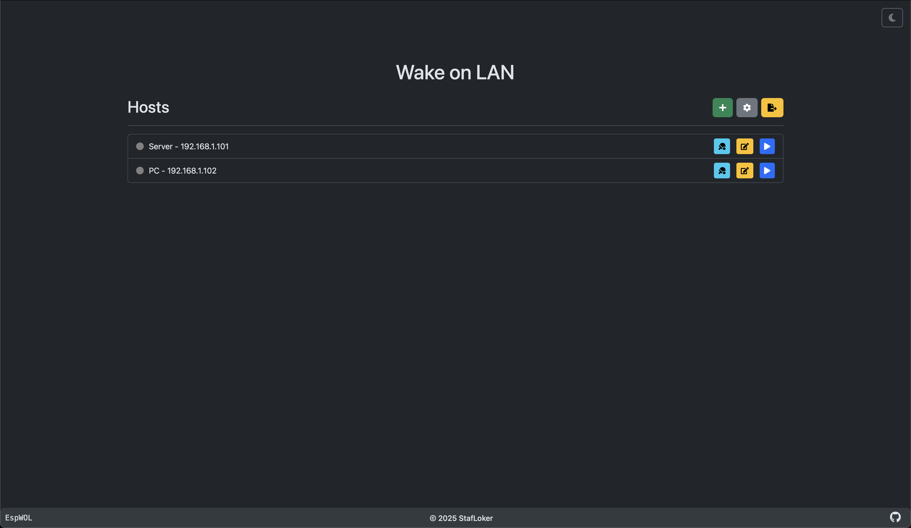

# EspWOL

This project provides a web-based interface for starting PCs using an ESP8266 and Wake On Lan magic packets.

## Features

- **Add PC**: Add new PCs to the list with their name, MAC address, and IP address.
- **Edit PC**: Edit the name, MAC address, or IP address of a PC.
- **Delete PC**: Remove a PC from the list (via modal window).
- **Wake on LAN**: Send a WOL request to wake a PC remotely.
- **Real-time Updates**: Changes to the PC list are updated in real-time without reloading the page.
- **Basic HTTP Authentication**: Enable or disable authentication, and update the username or password as needed.
- **Network Configuration**: Switch seamlessly between static IP and DHCP modes.
- **Host Ping Utility**: Test connectivity by pinging a specified host.
- **OTA**: Password: `ber#912NerYi`

## Requirements

- ESP8266 board (e.g., NodeMCU, Wemos D1 Mini)
- Arduino IDE
- ESP8266 library
- [WakeOnLan library](https://github.com/a7md0/WakeOnLan)
- [WIFI Manager library](https://github.com/tzapu/WiFiManager)
- [ArduinoJson library](https://github.com/bblanchon/ArduinoJson)
- [ESP8266Ping library](https://github.com/dancol90/ESP8266Ping)
- [ArduinoOTA](https://github.com/JAndrassy/ArduinoOTA)

## Installation

1. Clone this repository:
2. Open the project in the Arduino IDE.
3. Install the required libraries from the Library Manager
4. Upload the code to your ESP8266 board.

## Usage

1. Once the ESP8266 is powered and connected to Wi-Fi, navigate to the IP address displayed in the Serial Monitor using your web browser.
2. Use the web interface to manage your registered PCs:
   - Click the `+` button next to the **Registered PCs** title to add a new PC.
   - Click the **settings** button next to any PC to edit its details.
   - Use the **play** button to send a Wake-on-LAN request to a PC.

## References

- Fork of project: [EspWOL](https://github.com/Tirarex/EspWOL)